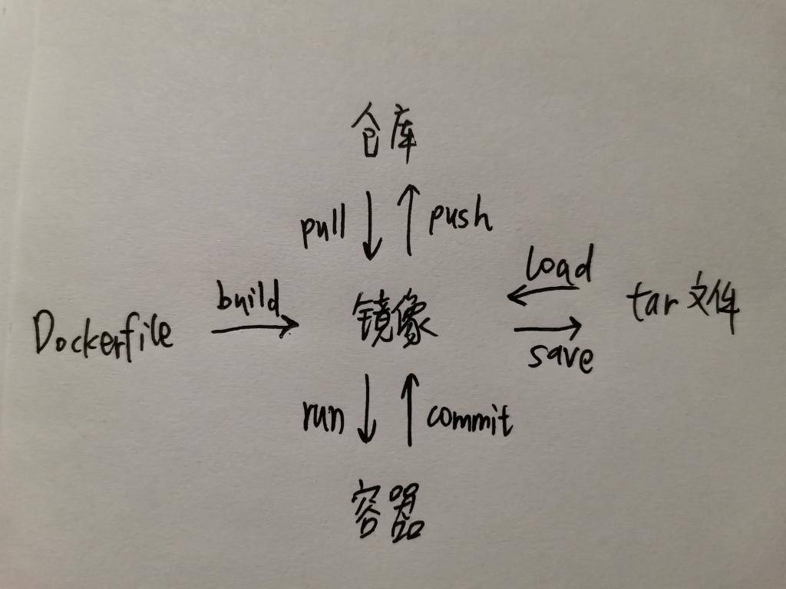

# dev-tools

开发环境使用的工具

[TOC]

## 1. tmux

### 基本概念

服务server：开启tmux服务 --》打开QQ软件；  
会话session：多个会话相当于登录多个QQ账号；  
窗格pane：每个pane表示一个伪终端；  
窗口window：多个pane组成的当前屏幕；  

### 常用快捷键
！！！重新配置tmux快捷键后，需要重启session使其生效；  
配置文件的路径：~/.tmux.conf；  

```shell
# window
prefix + c : 新建窗口
prefix + & : 关闭窗口
prefix + l : 切换到上一个窗口
prefix + w : 选择窗口的列表

# pane
prefix + % : 水平划分
prefix + " : 垂直划分
prefix + x : 关闭窗格
prefix + 方向键或者o : 切换窗格
prefix + z : 当前窗格的放大zoom（恢复就是再按一次）
```
### 参考资料

[bilibili十分钟掌握 tmux](https://www.bilibili.com/video/BV1ab411J7xT?from=search&seid=6153849982347372287)

## 2. docker

镜像，容器，tar文件，远程仓库；  



从仓库pull镜像，run容器，修改commit成新的镜像，可以push到仓库。

### 常见指令

### 参考资料

docker在线使用网站: docker playground  

[【docker入门】10分钟，快速学会docker](https://www.bilibili.com/video/BV1R4411F7t9?from=search&seid=12140693276330420335)

## 3. SSH

取消ssh私钥的安全密码(passphrase)

```shell
# 使用openssl重新生成不带密码的私钥
openssl rsa -in ~/.ssh/id_rsa -out ~/.ssh/id_rsa_new
mv ~/.ssh/id_rsa ~/.ssh/id_rsa.backup
mv ~/.ssh/id_rsa_new ~/.ssh/id_rsa
chmod 600 ~/.ssh/id_rsa
```
### 参考资料
[openssl重新生成不带密码的私钥](https://www.jianshu.com/p/9c646aceaa65)